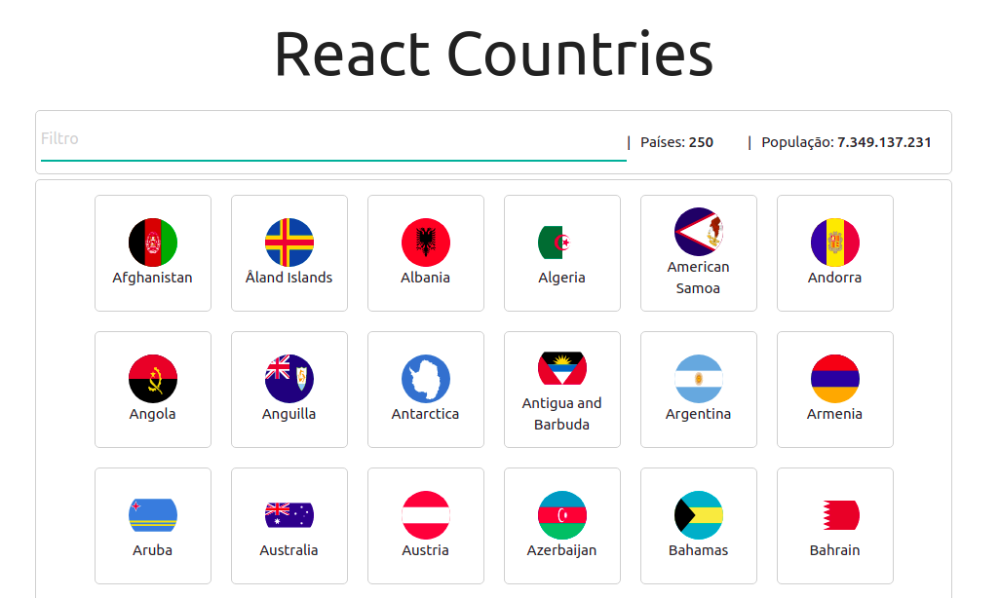
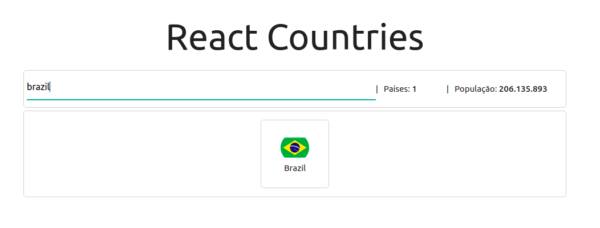

<p align="center">
  <a href="https://reactjs.org/">
    
  </a>

  <a href="https://www.linkedin.com/in/jeffersonsjunior/">
    
  </a>

  
</p>


## React Countries
Pequeno projeto feito em ReactJS, faz uma apresentação dos paises com sua bandeira, filtra os paises e exibe a informacao sobre o numero da populacao de acordo com o pais filtrado.

## Informacoes do projeto
- Trabalhando com componentizacao.

- trabalhando com estados da aplicacao.

- trabalhando com lifecycle com componentDidMount.

- Desestruturacao de estado e props.

- Monitoramento dos inputs com reactJS, utilizando os atributos em Value e Onchange.

- Funcoes simples, isolando em Helpers, assim sao mais facilmente reaproveitadas.

- Materialize & css externo.


## :cyclone: Como executar este projeto?
```
# Clone este repositório
$ git clone https://github.com/jefferson1104/reactJS-countries-search.git

# Acesse a pasta do projeto no terminal/cmd
$ cd ReactCountries

# instale os modulos utilizando o gerenciador de pacotes yarn ou npm
$ yarn 
$ npm

# Inicie a aplicação com 
$ yarn start
```

## Screenshots

